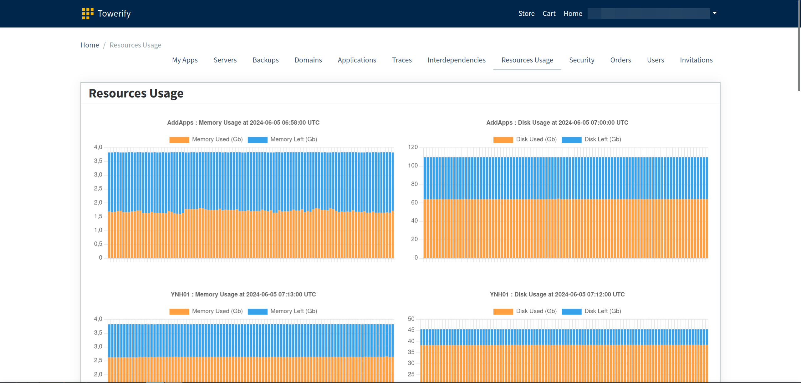
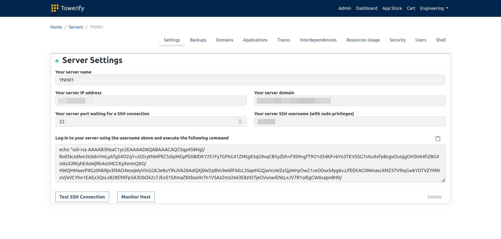
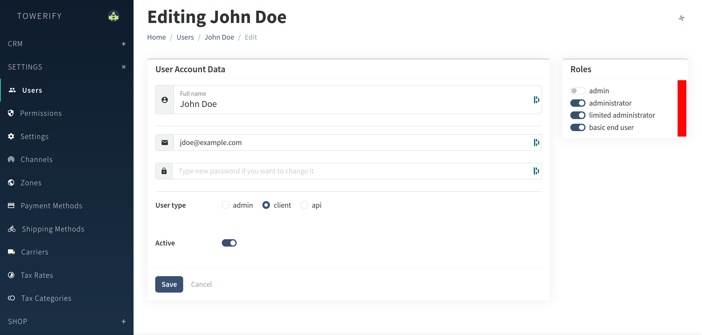

<div align="center">
  <a href="https://towerify.io/" target="_blank">
    <picture>
      <source media="(prefers-color-scheme: dark)" srcset="https://github.com/computablefacts/towerify/blob/main/towerify-logo.svg">
      
    </picture>
  </a>
  <br>
</div>
<div align="center">
  <em>
    Manage fleet of <a href="https://yunohost.org/#/" target="_blank">YunoHost</a> servers.
  </em>
</div>
<h5 align="center"></h5>
<div align="center">

[](https://github.com/computablefacts/towerify/actions/workflows/tests.yml)
[](LICENCE.md)
[](https://github.com/computablefacts/towerify/releases/latest)

</div>

__The goal of Towerify, an open core project, is to efficiently manage a fleet of YunoHost servers, making it easier for
administrators to deploy, configure, and monitor these servers.__ Towerify achieves this by integrating three key open
source projects, each providing distinct capabilities:

1. __[YunoHost](https://yunohost.org/#/).__ In Towerify, YunoHost is used to automatically configure servers. It
   streamlines tasks like app deployment, user management, email setup, and domain handling. With YunoHost integrated,
   Towerify enables users to easily set up and manage servers without requiring deep technical expertise.
2. __[Osquery](https://osquery.io/).__ In Towerify, Osquery is used to effortlessly gather server metrics. It enables
   us to use SQL-based queries to check operating system data. With Osquery, Towerify can monitor the health and
   performance of YunoHost servers, offering real-time information on system operations, security risks, and policy
   compliance.
3. __[Vanilo](https://vanilo.io/).__ Vanilo is integrated into Towerify to handle the distribution and management of
   applications. While Vanilo is typically used as an e-commerce framework, in Towerify, it focuses on streamlining the
   software deployment and distribution processes. This integration allows business users to easily and consistently
   deploy applications across multiple YunoHost servers.

__Towerify is designed to be flexible and can be used with YunoHost servers that are already set up and running.__ This
means that even if you have YunoHost instances that were installed before integrating Towerify, you can still use
Towerify to manage these servers. This capability allows for seamless integration and management without the need to set
up new servers, making it convenient for users to adopt Towerify for existing setups.

> [!NOTE]
> Metrics and security event collection no longer depend on the server being YunoHost-based, as any Linux server can now
> be configured for automatic collection by running
> `curl -s https://app.towerify.io/setup/script?api_token=<token>&server_ip=<ip>&server_name=<name> | bash` as root on
> the target server.

## Contents

* [Getting Started](#getting-started)
* [Highlights](#highlights)
    * [At The System Level](#at-the-system-level)
    * [At The Server Level](#at-the-server-level)
* [User Personas](#user-personas)
* [Project Scope](#project-scope)
* [Contributing](#contributing)
* [Sponsoring](#sponsoring)
* [Security](#security)
* [Licence](#licence)
* [Thank You](#thank-you)
* [One More Thing...](#one-more-thing)

## Getting Started

Before going further, please make sure you have the Docker Engine installed. To install the Docker Engine, visit
Docker's installation page and follow the instructions for your platform.

To run Towerify locally, use the following command:

```
cp .env.example .env && php artisan key:generate && docker compose up
```

After the image is built, you can access Towerify user interface at http://localhost:8178 using the
username `demo@towerify.io` and the password `Demo-Pass` of the "super-administrator"
(see [User Personas](#user-personas) for details).

To change the username and password, you can modify the `ADMIN_EMAIL` and `ADMIN_PASSWORD` variables in your `.env`
file. Adjust these values to your desired credentials.

> [!NOTE]
> To run the project without Docker, please refer to the detailed installation guide
> available [here](CONTRIBUTING.md#local-development). This guide provides step-by-step instructions to set up and run
> Towerify on your local machine without using Docker.

## Highlights

### At The System Level



* __My Apps.__ The applications relevant to your work, making your dashboard cleaner and more efficient.
* __Servers.__ Displays the list of hardware resources to which you have permissions to deploy applications.
* __Backups.__ Enables you to download backups for recovery or archival purposes as required.
* __Domains.__ Displays the list of domains managed across all servers.
* __Applications.__ Display the list of applications installed across all servers.
* __Traces.__ Provides you with the ability to audit the latest actions performed across all servers, including commands
  that have been executed, those currently running, and upcoming commands.
* __Interdependencies.__ Presents a visual graph that illustrates the relationships and connections between various
  pieces of hardware and web services. Constructed by analyzing nginx logs.
* __Resources Usage.__ Provides a detailed breakdown of how much memory and storage is being utilized by each server.
* __Security.__ Offers a comprehensive overview of system events that could affect server security, including changes to
  access keys, system logins and logouts, user modifications, and alterations in kernel modules.
* __Security Rules.__ Display the list of Osquery rules deployed on your servers.
* __Orders.__ Serves as a comprehensive inventory of all the applications that have been deployed, tracking their
  statuses and relevant details.
* __Users.__ Provides a comprehensive inventory of all users who have been added and who have access to specific servers
  and applications.
* __Invitations.__ Allows you to send invitations to new users to join.

### At The Server Level



* __Settings.__ Facilitates the enrollment of new servers and provides options for installing YunoHost with just one
  click, an option that can be skipped if YunoHost is already installed. Additionally, it allows for the quick
  integration of Osquery, enabling detailed system monitoring through a single-click setup.
* __Backups.__ Trigger a full backup of the system configuration and application data, which can then be transferred to
  S3 or another storage service. You have the flexibility to download these backups as needed for recovery or archival
  purposes.
* __Domains.__ Displays all the domains managed by the current server, providing a comprehensive overview of the
  server's domain handling capabilities.
* __Applications.__ Displays all applications currently installed on the server, allowing you to effectively manage them
  by installing new applications or uninstalling existing ones.
* __Traces.__ Provides you with the ability to audit the latest actions performed on the server, including commands that
  have been executed, those currently running, and upcoming commands.
* __Interdependencies.__ Display the list of servers and services that interact with the server. Constructed by
  analyzing nginx logs.
* __Resources Usage.__ Provides a detailed breakdown of how much memory and storage is being utilized the server.
* __Security.__ Offers a comprehensive overview of system events that could affect the server security, including
  changes to access keys, system logins and logouts, user modifications, and alterations in kernel modules.
* __Users.__ Enables you to review who has access to the server and manage their permissions, ensuring control over
  the security perimeter.
* __Shell.__ Provides a straightforward web interface through which you can execute simple and non-interactive commands
  on the server.

## User Personas

Towerify enables various categories of users within the same __tenant__ (i.e., a team, an organization, etc.) to work
together towards a common goal: ensuring that the human resources of this tenant remain focused on innovation.

As a multi-tenant platform, each tenant in Towerify is created and administered by a different "super-administrator". By
default, a tenant is configured to take into account the personas described below:

* __Infrastructure providers__ are responsible for provisioning hosts. This persona corresponds to the `administrator`
  role in the Admin panel.
* __Operators__ are tasked with deploying applications on these hosts. This persona corresponds to
  the `limited administrator` role in the Admin panel.
* __Users__ access the deployed applications or develop new services to be deployed on these hosts. This persona
  corresponds to the `basic end user` role in the Admin panel.



The permissions and roles system used by Towerify is extremely flexible, making it entirely feasible to model other
personas beyond those described here.

## Project Scope

The Towerify project operates under three strict laws:

* __Focus on fleet understanding.__ Any new features or screens introduced in Towerify, the platform being developed,
  must aim to improve understanding across the entire fleet of applications or servers. This law prioritizes tools and
  features that enhance visibility, monitoring, and analytics, focusing on providing clear insights into system
  operations and performance. This helps users and administrators make informed decisions based on comprehensive data.
* __Single-click deployment for all apps.__ Every application included in the project's catalog must be deployable using
  a single click. This rule emphasizes ease of use and accessibility, ensuring that the deployment process is as
  streamlined and user-friendly as possible. This can lead to innovations in the user interface and deployment scripts
  to adhere to this simplicity.
* __Server modifications through SSH only.__ All modifications to servers must be conducted through SSH (Secure Shell).
  This law standardizes the method of server administration, enforcing a secure, consistent, and controlled approach to
  system modifications. By mandating SSH, the project ensures that all changes are made using a protocol that supports
  encryption and secure network services, reducing vulnerabilities and maintaining a high standard of security.

## Contributing

First of all, thank you for your interest, and for taking your time to contribute to Towerify.

We have a set of guidelines for those wishing to contribute to Towerify, and we encourage you to take a look at them
here: [contributors' guidelines](CONTRIBUTING.md).

Your [pull requests](https://github.com/computablefacts/towerify/pulls) will be highly welcomed. If you're looking for
something to start with, you can check the [open issues](https://github.com/computablefacts/towerify/issues) on our
GitHub repository.

## Sponsoring

If you find that you lack the time or specific skills required to actively participate in the development or
documentation of the project, you can still contribute significantly by providing financial support. The most effective
way to support our efforts is to purchase a license for our commercial
product, [AdversaryMeter](https://adversarymeter.io). This helps us continue our work and improve the project further.

To fully benefit from Towerify's integration with AdversaryMeter, you need to generate a new API key from AdversaryMeter
and then update the `AM_API_KEY` property in the `.env` file of your Towerify project. Simply
replace `<your api key (optional)>` with your new API key in the `.env` file to ensure seamless communication between
the two services.

## Security

Towerify takes security issues very seriously. __Please, do not file GitHub issues or post on public forums for security
vulnerabilities__. Email <a href="mailto:engineering@computablefacts.com">engineering@computablefacts.com</a>
if you believe you have uncovered a vulnerability. In the message, try to provide a description of the issue and ideally
a way of reproducing it. The security team will get back to you as soon as possible.

See the [SECURITY](SECURITY.md) file for details.

## Licence

Unless you want to host Towerify yourself and sell it as a server management tool or marketplace, or to sell a product
that directly exposes Towerify's UI or API, you should be good to go!

See the [LICENSE](LICENCE.md) file for details.

## Thank You

Towerify would not be possible without the support and assistance of other open-source tools and companies! Visit
our [thank you page](THANK_YOU.md) to learn more about how we build Towerify.

## One More Thing...

Towerify comes pre-bundled with a selection of packaged applications, providing users with ready-to-use tools and
functionalities right out of the box:
[ClickHouse](https://github.com/computablefacts/clickhouse_ynh),
[Docker Registry](https://github.com/computablefacts/docker_registry_ds_ynh),
[Flarum](https://github.com/computablefacts/flarum_ynh),
[Jenkins](https://github.com/computablefacts/jenkins_ynh),
[Keycloak](https://github.com/computablefacts/keycloak_ynh),
[NiFi](https://github.com/computablefacts/nifi_ynh),
[NLM Ingestor](https://github.com/computablefacts/nlm_ingestor_ynh),
[Portainer](https://github.com/computablefacts/portainer_ynh),
[Superset](https://github.com/computablefacts/superset_ynh),
[Tika](https://github.com/computablefacts/tika_ds_ynh).
